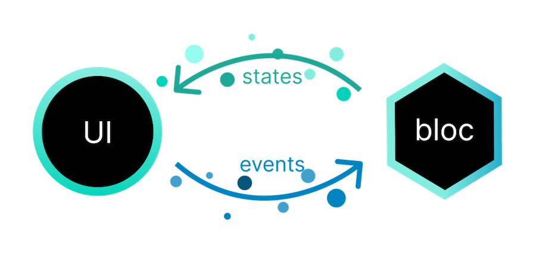
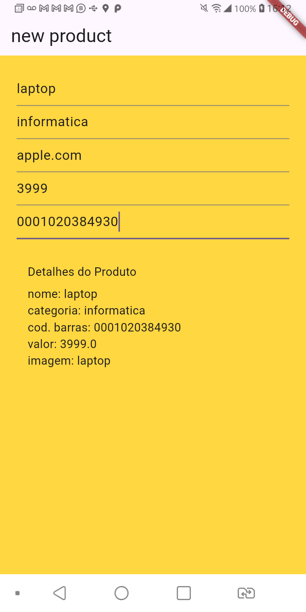

# Projetos Flutter com Bloc baseados na documentacao.

[](https://developer.mozilla.org/es/docs/Web/JavaScript)

## Overview 



## Examples

<div style="text-align: center">
    <table>
        <tr>
            <td style="text-align: center">
                <a href="https://bloclibrary.dev/tutorials/flutter-counter">
                    
                </a>
            </td>            
            <td style="text-align: center">
                <a href="https://bloclibrary.dev/tutorials/flutter-infinite-list">
                    
                </a>
            </td>
            <td style="text-align: center">
                <a href="https://bloclibrary.dev/tutorials/flutter-infinite-list">
                    
                </a>
            </td>
            <td style="text-align: center">
                <a href="https://bloclibrary.dev/tutorials/flutter-login">
                    
                </a>
            </td>
        </tr>
        <tr>
            <td style="text-align: center">
                <a href="https://bloclibrary.dev/tutorials/github-search">
                    
                </a>
            </td>
            <td style="text-align: center">
                <a href="https://bloclibrary.dev/tutorials/flutter-weather">
                    
                </a>
            </td>
            <td style="text-align: center">
                <a href="https://bloclibrary.dev/tutorials/flutter-todos">
                    
                </a>
            </td>
        </tr>
    </table>
</div>


## Comandos iniciais do projeto

```
$ flutter pub get
```


## Links relacionados

* Impacto: [Stack Overflow](https://survey.stackoverflow.co/2023/#most-popular-technologies-language) | [GitHub](https://github.blog/2023-11-08-the-state-of-open-source-and-ai/) | [Índice TIOBE](https://www.tiobe.com/tiobe-index/) | [Google Trends](https://trends.google.es/trends/explore?cat=5&date=today%205-y&q=%2Fm%2F02p97,%2Fm%2F05z1_,%2Fm%2F07sbkfb&hl=es)

* [Documentacao Bloc](https://developer.mozilla.org/es/docs/Web/JavaScript)
* [Playground](https://dartpad.dev/)
* [Flutter](https://flutter.dev/)
* [Visual Studio Code](https://code.visualstudio.com/)
* [Guía de estilo](https://google.github.io/styleguide/jsguide.html)

##  Ola, meu nome é Tarcisio Valentim.
### 💻 Fullstack Developer | iOS & Android | ReactJs | NodeJs.


Eu sou desenvolvedor de software desde 2020. Desde 2018, combino meu trabalho desenvolvendo aplicativos com a criação de conteúdo educacional sobre programação.

Pode encontrarnos em:


<div style="display: flex; justify-content: center;">

<a class="social" href="mailto:tarcisio.word@gmail.com" alt="Gmail" >
  
</a>

<a class="social" href="https://www.linkedin.com/in/devtvas/" alt="Linkedin" >
  
</a>

<a class="social" href="https://api.whatsapp.com/send?phone=5562998025403" alt="WhatsApp" >
  
</a>

</div>

> ##### Se consideras o conteúdo útil, apoia-o dando "★ Star" no repositório. Obrigado!